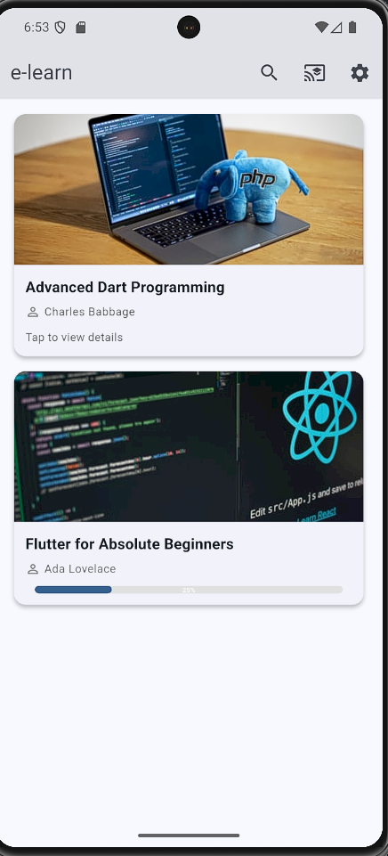
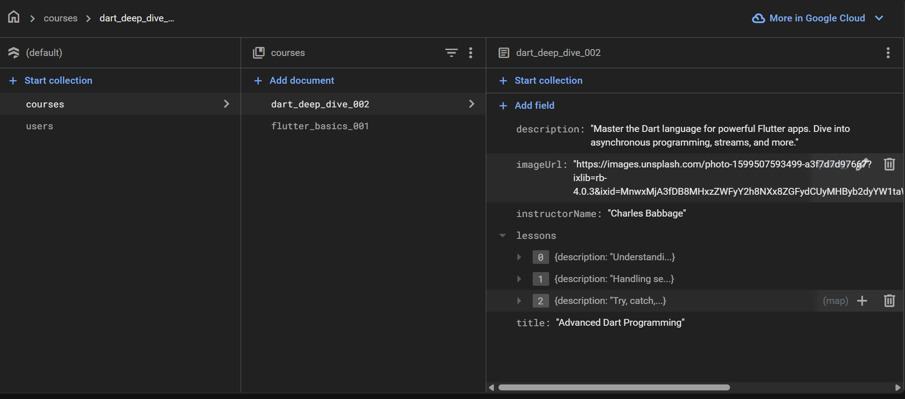
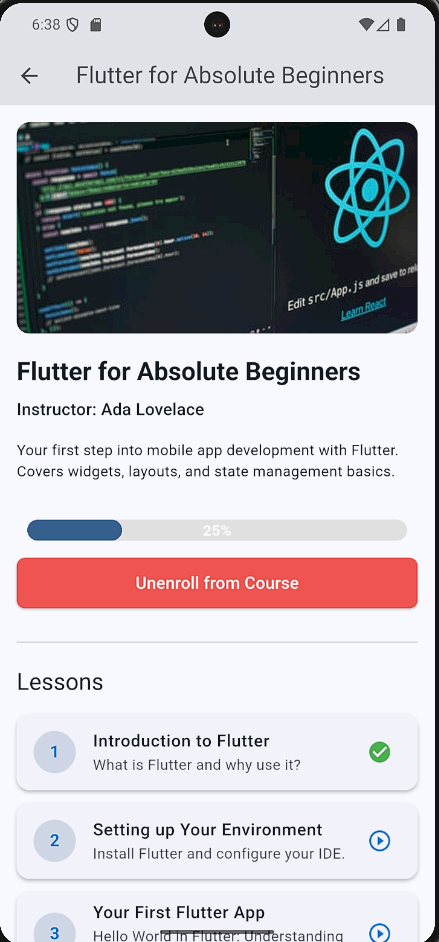
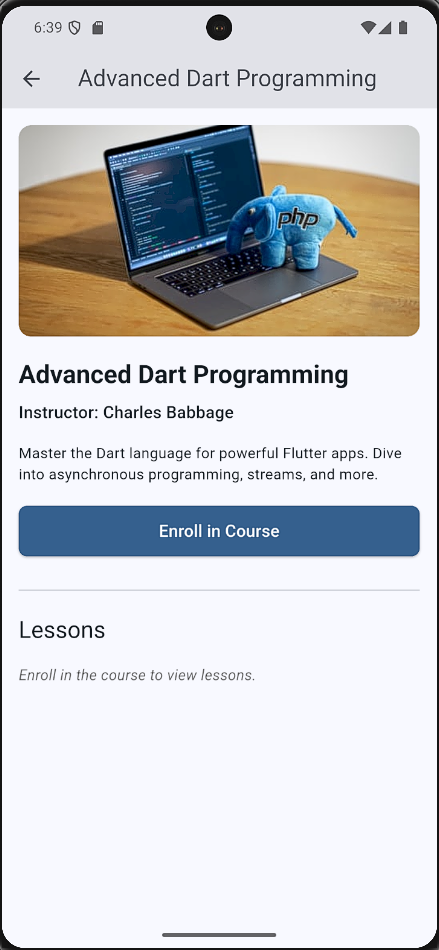
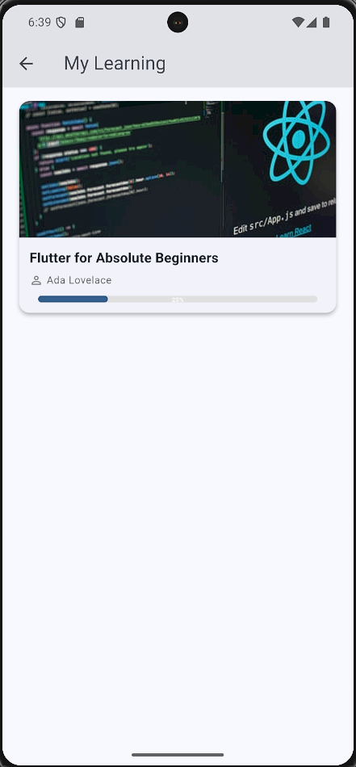
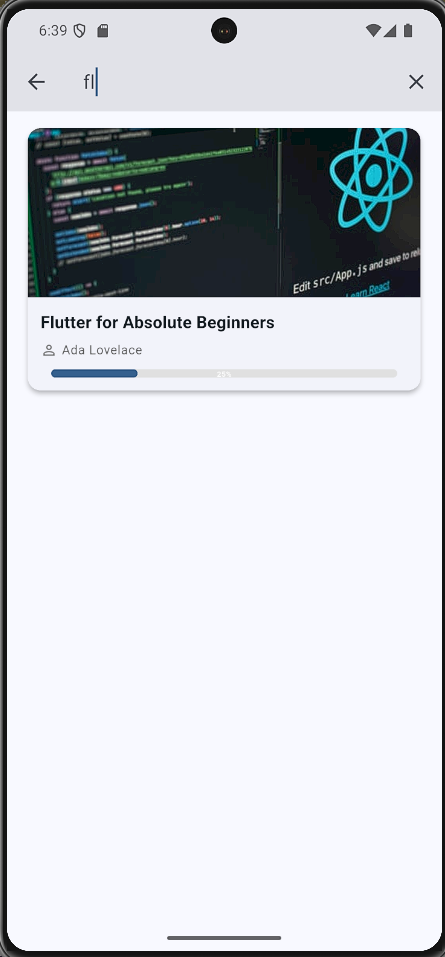
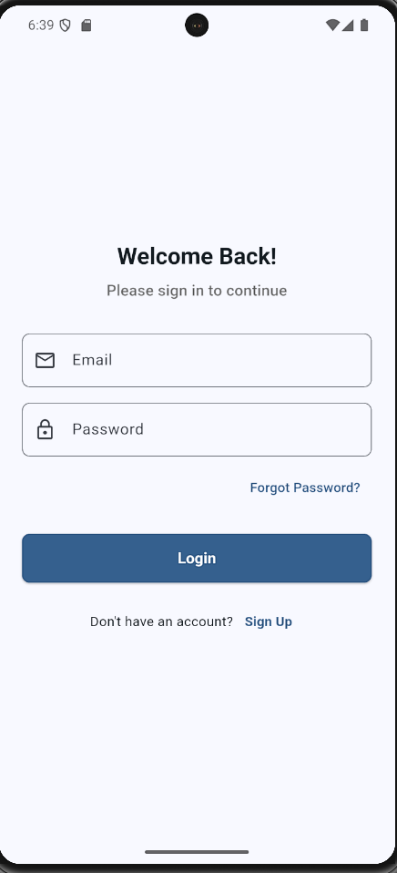
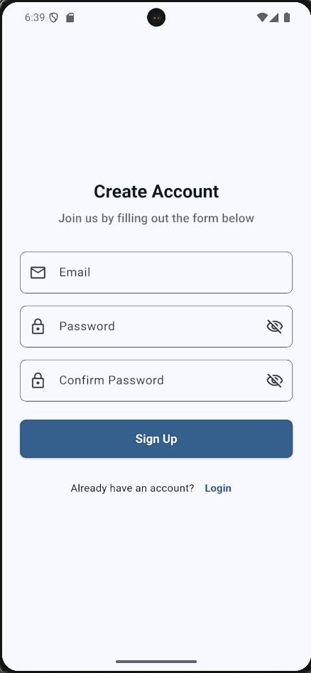
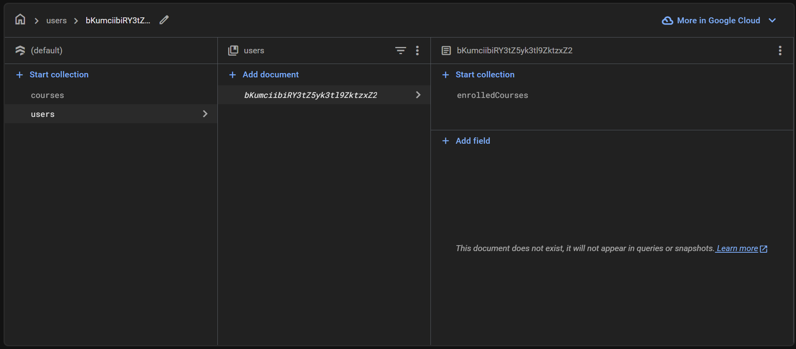
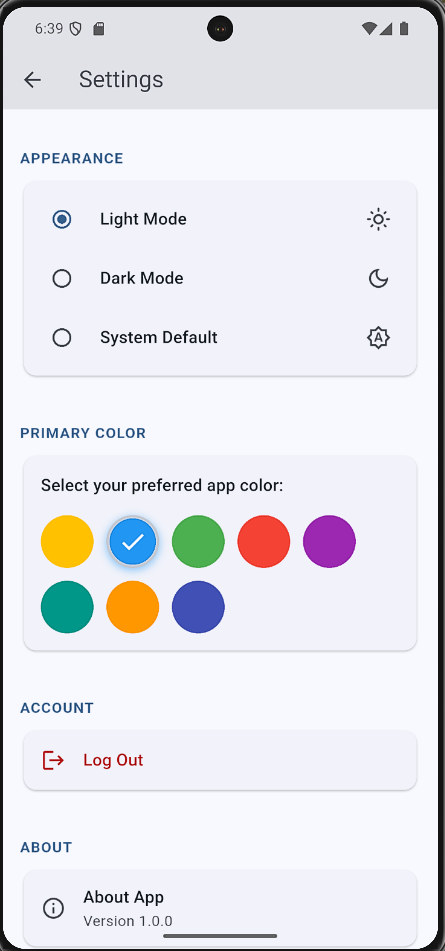

# 🎓 E-Learn (Coursera Clone)

A demo Flutter e-learning app inspired by **Coursera**.  
Users can browse courses, enroll, watch lessons, and track their progress.  
Built with **Flutter** and **Firebase**.

---

## ⚡ Features
- 🔑 Firebase Authentication (Sign up / Log in)
- 📚 Browse and search available courses
- 🎥 Watch lessons (sample video integration)
- ✅ Track course progress
- 👨‍🏫 User roles: Students & Instructors
- ⚙️ User settings and profile management

---

## 📸 Screenshots

| Home Screen | Courses | Course Details |
|-------------|---------|----------------|
|  |  |  |

| Enroll | My Courses | Search |
|--------|------------|--------|
|  |  |  |

| Login | Signup | Users | Settings |
|-------|--------|-------|----------|
|  |  |  |  |

---

## 🚀 Getting Started
Clone the repo and run locally:
```bash
git clone https://github.com/mrxyz606/e-learn.git
cd e-learn
flutter pub get
flutter run
```

## 📜 License
This project is licensed under the MIT License - see the [LICENSE](LICENSE) file for details.


## ✨ Author
👩‍💻 Developed by **Malak Mansour**  
📧 Contact: [mansormalak606@gmail.com](mailto:mansormalak606@gmail.com)  
🔗 GitHub: [mrxyz606](https://github.com/mrxyz606)  